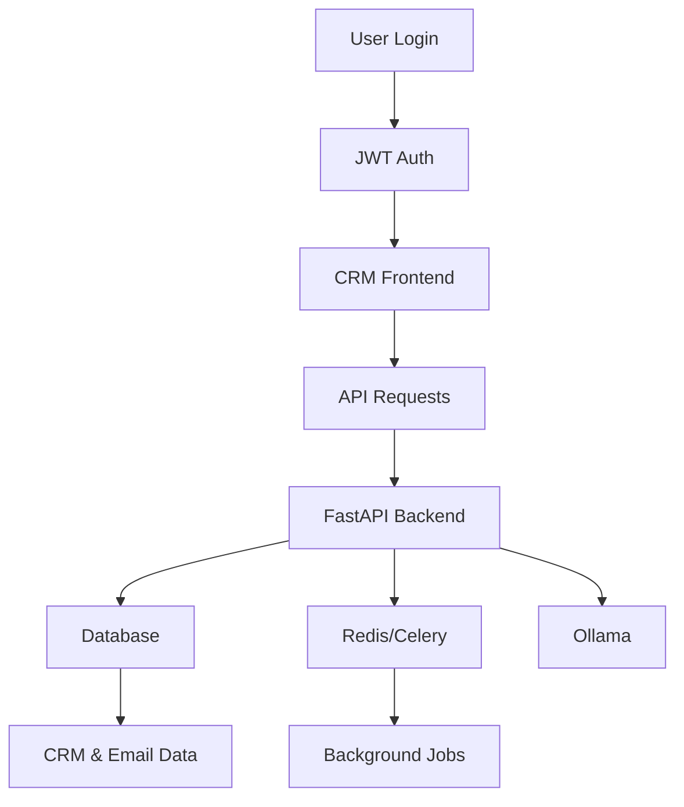
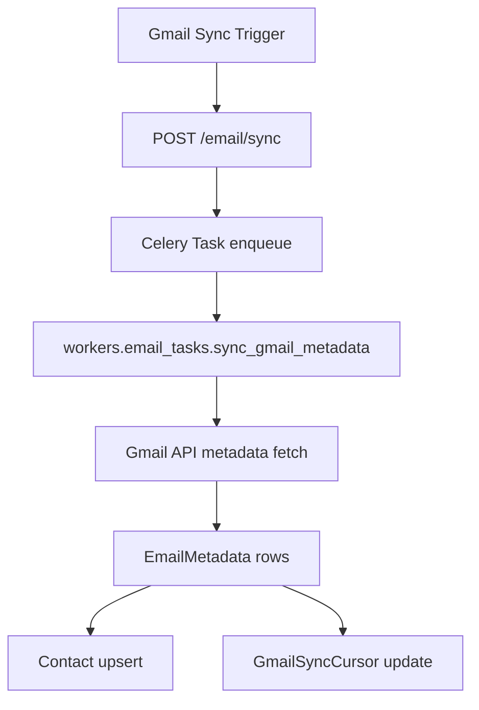
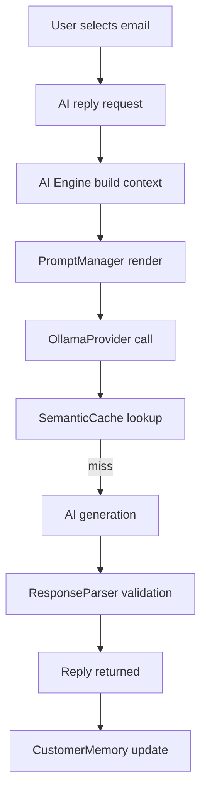
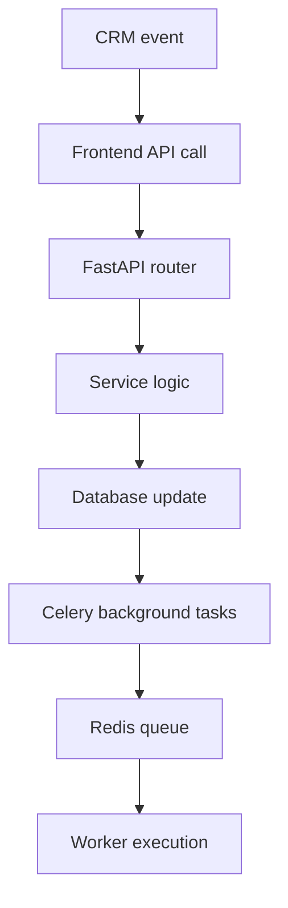
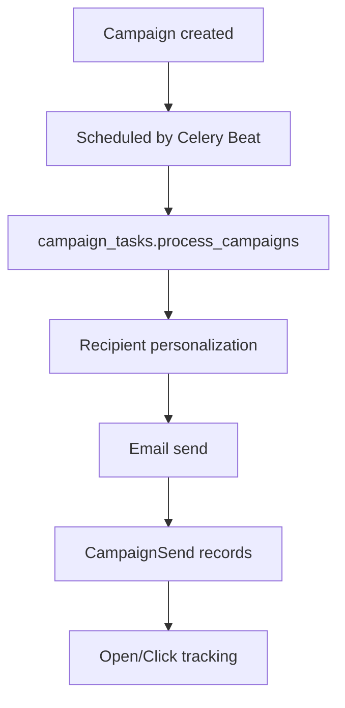

# ENTERPRISE CRM ARCHITECTURE

## Section 1: Executive Summary

### Product Description

The AI-Powered CRM & Email Automation Platform is an enterprise-ready CRM application designed to unify customer relationship management, email automation, AI-generated responses, lead scoring, campaign management, and analytics into a single SaaS-grade product.

It combines a modern single-page React frontend with a Python FastAPI backend, integrated AI services, Gmail synchronization, background job processing, Redis caching, WebSockets for live updates, and optional document knowledge retrieval through ChromaDB.

### Business Objective

The platform is built to accelerate enterprise sales and support workflows by automating repetitive CRM tasks, providing AI-assisted email responses, classifying inbound communications, and surfacing actionable insights from customer interactions.

It enables organizations to:

- centralize customer communication and CRM data,
- apply AI to classify emails, generate replies, and score leads,
- automate campaign execution and email sync,
- monitor performance through dashboards and analytics,
- maintain continuous processing via Celery and Redis.

### Enterprise Vision

This project is architected as an extensible enterprise SaaS solution that can support:

- repeated deployment in production environments,
- secure authentication and access control,
- background orchestration for high-volume email and campaign workflows,
- AI-driven augmentation for sales, support, marketing, and recruiting teams.

### Intended Customers

The target customers are small-to-medium enterprises and digital teams that require:

- CRM and lead tracking,
- email automation for Gmail inboxes,
- AI-assisted customer response drafting,
- campaign delivery and analytics,
- a unified platform with sales, contacts, and workflows.

### Production Readiness

The repository has a production-oriented architecture with the following readiness signals:

- fast backend API with health checks,
- Docker support for service orchestration,
- Redis-backed Celery queue configuration,
- frontend built with React and Vite,
- modular AI abstraction and providers,
- database schema and migrations preparation,
- JWT authentication and OAuth support,
- monitoring-ready endpoints and background job scheduling.

The platform is production-ready in terms of architecture and integration, but deployment should still verify environment variables, secrets, database migration, and AI provider availability.

---

## Section 2: System Overview

### Frontend

The frontend is implemented as a React single-page application using Vite. It supports:

- Dashboard and metrics views,
- Inbox view with Gmail-synced email metadata,
- Contact management,
- Pipeline and deal management,
- Campaign management,
- AI tasks and reply generation,
- Analytics and reporting,
- Settings and user authentication.

It uses React Router for navigation, Tailwind CSS for styling, and Recharts for charting.

### Backend

The backend is a FastAPI application with an enterprise structure:

- authentication (`auth/`),
- configuration (`config/`),
- database access (`database.py`),
- caching (`cache/`),
- routers (`routers/`),
- AI engine (`ai/`),
- Gmail sync (`crm_email/`),
- workers and Celery tasks (`tasks/`, `workers/`),
- WebSocket management (`ws_manager/`).

The backend exposes REST APIs, WebSocket endpoints, health checks, and background task triggers.

### Database

The platform persists data through SQLAlchemy models backed by SQLite for development or PostgreSQL for production.

The schema includes:

- users,
- contacts,
- leads,
- deals,
- interactions,
- activities,
- customer profiles,
- notes,
- campaigns,
- campaign recipients/sends/tracks,
- email metadata,
- AI memory stores,
- classification rules,
- sync cursors,
- analytics artifacts.

### AI Layer

The AI layer is modular and provider-agnostic. It currently supports:

- Ollama local provider integration,
- prompt management through Jinja2 templates,
- context building from CRM data,
- semantic caching in Redis,
- strict response parsing with retry logic,
- knowledge retrieval through ChromaDB.

The AI Engine exposes capabilities for reply generation, classification, scoring, summarization, and customer profile generation.

### CRM

The CRM subsystem covers:

- contact and customer profile management,
- leads and sales pipeline tracking,
- deal lifecycle and AI scoring,
- interaction history,
- activities and follow-ups,
- AI insights and recommendations.

### Task Queue

Background jobs are handled by Celery with Redis as the broker and result backend. The system includes:

- Gmail sync tasks,
- campaign processing tasks,
- lead follow-up checks,
- analytics refresh tasks,
- dashboard metrics refresh,
- campaign retries and monitoring.

### Caching

Redis caching is used for:

- semantic AI response caching,
- Celery broker and backend,
- health checks and rate limiting fallback.

A fallback in-memory cache is available when Redis is unavailable.

### WebSockets

WebSockets are implemented with FastAPI’s WebSocket support and a custom manager. They support live analytics updates and AI streaming.

### Deployment

Deployment is supported through Docker and Docker Compose for production-like infrastructure. The Docker stack includes:

- PostgreSQL database,
- Redis cache,
- API service,
- Celery worker,
- Celery beat scheduler.

The repository also includes a `Dockerfile` and a health check configuration.

---

## Section 3: Technology Stack

### FastAPI

FastAPI is the backend web framework. It provides high-performance asynchronous HTTP routing, pydantic validation, dependency injection, and automatic API docs.

Why chosen:

- production-ready Python API framework,
- performance comparable to Node.js,
- built-in data validation and type safety,
- strong developer ergonomics.

### React

The frontend uses React 19 and Vite. Pages are built as reusable functional components.

Why chosen:

- modern SPA framework,
- component-based architecture,
- efficient reactivity for CRM dashboards,
- strong ecosystem with React Router and hooks.

### Tailwind CSS

Tailwind CSS is used for the UI styling system.

Why chosen:

- utility-first styling enables rapid UI iteration,
- consistent theming without writing custom CSS,
- compact responsive classes.

### Redis

Redis is used as the Celery message broker and result backend, and as the semantic AI cache.

Why chosen:

- high-performance in-memory storage,
- native support for Celery,
- low-latency caching for AI prompts,
- lightweight and production-proven.

### Celery

Celery provides asynchronous background processing and scheduled tasks.

Why chosen:

- handles long-running tasks outside HTTP requests,
- supports task queues, retrying, scheduling,
- fits enterprise job processing needs.

### SQLAlchemy

SQLAlchemy is the ORM for database persistence.

Why chosen:

- strong SQL abstraction and schema definition,
- support for relational database engines (SQLite/PostgreSQL),
- mature tooling for production schemas.

### JWT

Authentication uses JWT tokens via `python-jose`.

Why chosen:

- stateless auth tokens for SPA clients,
- easy integration with FastAPI dependencies,
- standard for modern API security.

### Ollama

The AI provider is Ollama with a local model endpoint.

Why chosen:

- local AI inference support,
- avoids cloud dependency for initial deployment,
- enables on-premise usage and enterprise control.

### ChromaDB

ChromaDB is used for RAG knowledge storage.

Why chosen:

- vector search for document retrieval,
- supports grounding AI responses on business knowledge,
- local persistence via Chroma.

### Jinja2

Prompt templates are rendered with Jinja2.

Why chosen:

- decouples prompt engineering from code,
- enables reusable templates for AI tasks,
- supports safe formatting across prompt types.

### Gmail API

Gmail integration is implemented using Google API client libraries.

Why chosen:

- industry standard for Gmail access,
- supports OAuth, metadata sync, message retrieval,
- preserves security and email integrity.

### WebSockets

WebSocket support is implemented in FastAPI and custom WebSocket managers.

Why chosen:

- real-time dashboard metrics,
- live AI reply streaming,
- interactive front-end experience.

### Docker

Docker is used to package the backend service and dependencies.

Why chosen:

- consistent deployments,
- container orchestration for enterprise infrastructure,
- simplified environment setup.

---

## Section 4: Complete Folder Architecture

### Root folders

- `backend/` — primary server code, models, routers, AI engine, tasks, authentication, and database integration.
- `frontend/` — React SPA assets, pages, CRM UI components, and API integration.
- `data/` — application data and persistent storage artifacts.
- `docker-compose.yml` — multi-service deployment definitions.
- `Dockerfile` — backend container build instructions.

### Backend folder structure

- `backend/ai/` — AI engine, providers, prompt management, memory, RAG, and agents.
- `backend/auth/` — JWT auth, dependencies, routers, and models.
- `backend/cache/` — Redis client wrapper and fallback cache.
- `backend/config/` — centralized configuration and environment variable management.
- `backend/crm_email/` — Gmail synchronization, cursor management, metadata ingestion.
- `backend/models/` — SQLAlchemy ORM table definitions.
- `backend/routers/` — FastAPI endpoints for email, CRM, contacts, campaigns, analytics, AI, agents, tasks, recommendations, WebSockets, and knowledge.
- `backend/services/` — business logic services for CRM and AI operations.
- `backend/tasks/` — Celery application and periodic schedule.
- `backend/workers/` — worker functions for email sync, AI reply generation, campaign processing.
- `backend/ws_manager/` — WebSocket connection manager and routing.
- `backend/middleware/` — request middleware for security and rate limiting.

### Frontend folder structure

- `frontend/src/` — React source code,
- `frontend/src/crm/` — CRM pages, analytics, inbox, contacts, campaigns, AI tasks, dashboards,
- `frontend/src/context/` — auth and theme providers,
- `frontend/src/components/` — reusable UI components,
- `frontend/src/pages/` — login, register, auth callback,
- `frontend/src/App.jsx` — route definitions and main entry point,
- `frontend/src/main.jsx` — React app bootstrap.

---

## Section 5: AI Architecture

### AI Engine

The AI Engine is implemented in `backend/ai/services/ai_engine.py`.

It provides both:

- legacy direct methods for classification, reply generation, scoring, summarization,
- a multi-agent routing mechanism via `AgentRouter`.

The engine hides provider details and delegates actual inference to the configured provider.

### Provider Layer

The provider abstraction is defined in `backend/ai/providers/base_provider.py`.

Current provider implementation:

- `backend/ai/providers/ollama_provider.py` — connects to Ollama REST API.

It exposes:

- `generate()` for synchronous response creation,
- `stream_generate()` for tokenized streaming,
- `health_check()` for model availability.

### Prompt Manager

`PromptManager` uses Jinja2 templates located under `backend/ai/prompts/`.

It ensures prompts are:

- isolated from Python code,
- reusable across functions,
- rendered securely with context variables.

### Context Builder

Context aggregation is implemented in `backend/ai/context/context_builder.py`.

It builds a comprehensive customer context from:

- contact details,
- lead score,
- customer memory,
- recent interactions,
- active deals,
- notes and activities,
- knowledge base data.

The context is sanitized before use.

### Memory

`backend/models/ai_memory.py` defines `CustomerMemory`.

The AI memory store holds:

- communication style,
- products discussed,
- pain points,
- objections,
- buying signals,
- previous summaries,
- campaign/history notes,
- support/hiring-specific data.

This supports persistent customer context across AI interactions.

### RAG

The knowledge base implementation is in `backend/ai/rag/knowledge_base.py`.

It uses ChromaDB to:

- store document chunks,
- perform vector similarity search,
- return relevant snippets to inject into prompts.

If ChromaDB is unavailable, RAG gracefully degrades.

### Response Parser

`ResponseParser` enforces JSON output for structured tasks.

It wraps provider generation and retries until valid JSON is returned. This is crucial for tasks like lead scoring and classification.

### Redis Cache

Semantic caching stores AI responses by hashing prompt content.

This reduces repeated compute and preserves performance for identical prompt requests.

### AI Task Flow

The AI workflow in the current codebase is:

1. user invokes an AI endpoint,
2. AI Engine builds context,
3. prompt manager renders the template,
4. AI provider executes inference,
5. response parser validates output,
6. cache stores the result,
7. memory manager updates customer memory.

### Workflow

The repository also includes phased multi-agent architecture with specialized agents (email, sales, hiring, support, marketing, analytics, knowledge) registered in `AIEngine._register_agents()`.

This indicates the foundation for agent-based workflows is built, though actual agent routing and orchestration may be partially implemented.

---

## Section 6: CRM Architecture

### Contacts

`models/crm.py` defines `Contact`.

Contacts capture:

- email,
- name,
- company,
- title,
- source,
- last interaction,
- sentiment,
- relationship score.

Contacts are uniquely keyed by user and email.

### Companies

Company data is stored on contacts as `company` strings. There is no separate company entity in the current schema.

### Leads

`Lead` is a one-to-one relationship with `Contact`.

Lead fields include:

- score,
- label,
- confidence,
- recommended next action,
- buying intent,
- urgency,
- hiring intent.

The system can query leads ordered by score.

### Pipelines

`Deal` represents pipeline and opportunity records.

It includes:

- stage,
- status,
- value,
- probability,
- expected/actual close dates,
- AI score,
- AI recommendation.

Simple pipeline aggregation is exposed via `/crm/pipeline`.

### Campaigns

Campaign data exists in two forms:

- `models.crm.Campaign` — simplified campaign table,
- `models.campaigns.Campaign` — richer Phase 9 campaign schema with scheduling, tracking, personalization, and metrics.

Campaigns include recipients, sends, clicks, opens, retry logic, and analytics counters.

### Activities

`Activity` records tasks and follow-ups.

They include:

- type,
- title,
- description,
- status,
- due date.

Activity APIs support listing and filtering by contact.

### Notes

`Note` stores contact-specific free text notes.

These are included in AI context generation.

### Interactions

`Interaction` records CRM interactions.

It includes:

- channel,
- direction,
- subject,
- snippet,
- sentiment,
- occurred at.

These are used by AI context builder and analytics.

### Deals

Deal entities are connected to contacts and can capture AI recommendations.

Deal analytics and pipeline stage aggregation are exposed in the frontend.

### Customer Profiles

`CustomerProfile` stores AI-generated customer summaries:

- buyer persona,
- buying style,
- pain points,
- interests,
- company industry,
- engagement level.

A profile can be refreshed via `/crm/contacts/{contact_id}/profile/refresh`.

### AI Insights

`AIInsight` stores AI-generated observations and recommendations.

The `/crm/insights` endpoint returns recent insight records.

---

## Section 7: Email Automation

### Incremental Sync

The Gmail sync module stores metadata in `EmailMetadata`.

`crm_email/incremental_sync.py` performs:

- history-based incremental sync using Gmail history IDs,
- metadata fetch of new messages,
- thread ID preservation,
- date ordering,
- contact upsert.

It writes `GmailSyncCursor` records to track sync state.

### Metadata First

The system syncs email metadata before body content. This allows fast email listing and deferred body fetch.

`/email/metadata` returns message summaries while bodies are loaded later.

### Cursor Pagination

Gmail sync uses `GmailSyncCursor` to track the next page token and last history ID.

This enables efficient incremental paging.

### Thread Handling

Email threads are preserved through `thread_id` fields.

Thread IDs are included in metadata and context responses.

### Classification

Email classification is supported via:

- `/email/classify/{gmail_message_id}` — AI-driven classification,
- `/email/classify/{gmail_message_id}/manual` — manual label assignment and learning,
- `/email/classify` — batch classification of queued/failed/unknown emails.

Learned classification rules can automatically classify similar emails.

### Reply Generation

AI-generated reply drafts are produced via `/api/v1/ai/generate-reply` and the legacy draft endpoint `/email/draft`.

The engine builds context from CRM and email data, then renders a reply prompt.

### Follow-up Automation

The project includes campaign scheduling and periodic follow-up tasks in Celery, which is the foundation for automation. Exact rules are encoded in task modules.

### Smart Context

Reply generation uses the `ContextBuilder` to assemble contact, lead, interaction, deal, note, and knowledge context.

It sanitizes PII before sending prompts.

### Scheduling

Celery Beat schedules tasks such as:

- Gmail sync every 5 minutes,
- lead follow-up checks hourly,
- campaign monitoring every minute,
- analytics refresh daily.

### Background Processing

Background job modules exist for email sync, campaign processing, AI reply generation, and scheduled pipeline metrics.

This ensures CRM and AI workloads run outside the request path.

---

## Section 8: AI Features

### Classification

Email classification is available for synced metadata and new subject/body pairs.

The AI Engine maps categories and supports learned rules.

### Lead Scoring

The system includes a lead scoring task and lead labels, though additional detailed scoring logic appears to be phase-based and partially implemented.

### Reply Generation

AI reply generation is implemented via provider prompts and CRM context.

It is available both as a REST endpoint and through WebSocket streaming.

### Summarization

The engine has text summarization capabilities.

Email and thread summarization methods exist in the AI Engine.

### Sentiment

Sentiment analysis is supported in the AI Engine and CRM interaction records.

### Hiring / Resume Analysis

The AI Engine exposes candidate extraction and hiring-oriented methods, but there is no dedicated resume upload UI in the current frontend.

### Campaign Generation

The AI Engine can generate campaign content based on goal and audience.

Campaign scheduling and recipient personalization are present.

### Knowledge Search

RAG search is available through ChromaDB.

Knowledge base retrieval is used during context building for AI generation.

### Customer Profile

Customer profile generation exists and can be refreshed.

It uses AI to summarize engagement, persona, pain points, and interests.

### Memory

Persistent AI memory is stored per contact, including preferences and historical signals.

### Recommendations

The frontend includes recommendation endpoints and AI insights, though analytical depth is partially implemented.

---

## Section 9: Performance Optimizations

### Redis Cache

Redis is used for semantic caching and as Celery broker/backend.

The cache includes TTL-based expiration and fallback memory cache.

### Celery

Task configuration is tuned for efficient enterprise processing:

- `worker_prefetch_multiplier=1`,
- `worker_max_tasks_per_child=100`,
- task acknowledgement and retry settings,
- separate queues for email, AI, campaigns, analytics, dashboard.

### Lazy Loading

Email bodies are loaded on demand when requested, keeping list rendering light.

### Pagination

API endpoints support pagination with `limit` and `offset`.

Email metadata, contacts, and search endpoints use pagination.

### Code Splitting

The frontend uses React lazy loading for route-based bundles.

### Background Tasks

Long-running operations are offloaded to Celery workers.

### Low RAM Design

Configuration includes small Ollama models, reduced context windows, and a development fallback cache to support low-memory environments.

---

## Section 10: Security

### JWT

Authentication is handled with JWT using `python-jose`.

Tokens are issued on login/register and validated by FastAPI dependencies.

### OAuth

Google OAuth is supported for Gmail integration and user sign-in.

### Encryption

Sensitive secrets are managed through environment variables.

### Environment Variables

The project expects production secrets in `.env` with strong `JWT_SECRET_KEY` and `TOKEN_ENCRYPTION_KEY`.

### Rate Limiting

A middleware-based rate limiter exists in `backend/middleware/rate_limit.py`.

### Middleware

Security headers and rate limiting are enforced in `backend/main.py`.

### Input Validation

FastAPI and Pydantic validate request payloads.

### Sanitization

`utils/sanitize.py` is used for email text sanitization and protection against unsafe content.

---

## Section 11: API Documentation

### Authentication

- `POST /auth/register` — register a new user.
- `POST /auth/login` — login and obtain JWT.
- `GET /auth/me` — current user profile.
- `GET /auth/verify?token=...` — verify email token.

### Email

- `POST /email/sync` — queue Gmail sync task.
- `GET /email/metadata` — list synced email metadata.
- `GET /email/search` — search synced email metadata.
- `GET /email/{gmail_message_id}` — get email metadata and optionally body.
- `GET /email/body/{gmail_message_id}` — fetch email body.
- `POST /email/classify/{gmail_message_id}` — classify a synced email.
- `POST /email/classify/{gmail_message_id}/manual` — manually classify email.
- `POST /email/classify` — batch classify unsynced or queued emails.
- `POST /email/draft` — request an AI-generated draft.
- `GET /email/context/{gmail_message_id}` — get selected email context.

### CRM

- `GET /crm/contacts` — list contacts.
- `GET /crm/leads` — list leads.
- `GET /crm/pipeline` — summary stage metrics.
- `GET /crm/activities` — list recent activities.
- `GET /crm/contacts/{contact_id}/interactions` — contact interaction history.
- `GET /crm/contacts/{contact_id}/profile` — customer profile.
- `POST /crm/contacts/{contact_id}/profile/refresh` — refresh profile.
- `GET /crm/insights` — AI insights.

### AI

- `GET /api/v1/ai/health` — AI health check.
- `POST /api/v1/ai/classify-email` — classify text.
- `POST /api/v1/ai/generate-reply` — generate reply.
- `POST /api/v1/ai/cache/clear` — clear AI cache.
- `POST /api/v1/ai/model/warmup` — unsupported stub.
- `GET /api/v1/ai/model/info` — unsupported stub.

### Campaigns

- Campaign router endpoints exist for campaign creation, analytics, and processing, though full UI coverage is phase-dependent.

### Analytics

- analytics routers provide summary, activities, pipeline, and dashboard metrics.

### Tasks

- `GET /tasks/{id}` and `/tasks/status/{task_id}` are available for task tracking.
- `POST /tasks/sync-gmail` triggers Gmail sync tasks.

### WebSocket

- `/ws/{user_id}` — authenticated WebSocket endpoint for live metrics subscriptions.
- `/api/v1/ai/ws/stream` — AI streaming reply endpoint.

---

## Section 12: Frontend Architecture

### Dashboard

A dashboard page displays high-level CRM metrics, live metrics, AI recommendations, and workspace activity.

### Inbox

The inbox page is used for email metadata browsing and integrates Gmail-synced emails.

### Contacts

A contacts page lists CRM contacts and allows navigation to profiles and interactions.

### Pipeline

The pipeline page shows deal stages and sales opportunities.

### Campaigns

Campaign pages manage campaign creation and analytics.

### Analytics

The analytics page visualizes CRM metrics and charts for email categories, lead temperature, and campaign delivery.

### AI Tasks

The AI Tasks page supports:

- AI health and Celery health checks,
- email searching,
- synced email selection,
- AI classification and manual labeling,
- reply generation with tone selection,
- task queue control for Gmail sync,
- async task status polling.

### Settings

Settings provide user profile controls, theme toggles, and logout.

---

## Section 13: Database Schema

### Users

The auth user model includes email, password hash, roles, Google OAuth fields, and Gmail connection status.

### CRM Tables

- `crm_contacts` — contacts.
- `crm_leads` — lead metadata.
- `crm_interactions` — interaction history.
- `crm_activities` — tasks/activities.
- `crm_notes` — contact notes.
- `crm_deals` — sales deals and stages.
- `crm_deal_activities` — deal event records.
- `crm_customer_profiles` — AI-generated customer summaries.
- `crm_knowledge_base` (Chroma) — RAG store.

### AI & Email Tables

- `crm_customer_memory` — AI memory for contacts.
- `email_metadata` — Gmail message metadata.
- `email_classification_rules` — learned classification rules.
- `gmail_sync_cursors` — Gmail incremental sync tracking.

### Campaign Tables

- `campaigns` — campaign definitions,
- `campaign_recipients` / `campaign_sends` / `campaign_tracks` — recipient and tracking records.

### Relationships

- contacts link to leads, interactions, activities, notes, deals, and memory.
- deals link to contacts and deal activities.
- campaign sends link to campaigns and contacts.
- email metadata links to user and optionally contact.

### Indexes

Indexes include:

- unique user/email constraints on contacts,
- email metadata indexes on date, sender, status,
- lead score and deal stage indexes,
- campaign status indexes.

---

## Section 14: Workflow Diagrams











---

## Section 15: Production Readiness

### Scalability

The application separates web requests from background processing through Celery, enabling horizontal scaling of workers and API instances.

### Reliability

Health checks, retry-capable background jobs, and Redis-backed task states support resilience.

### Performance

Semantic caching and async AI provider calls reduce repeated compute. Email metadata sync and lazy body fetch improve responsiveness.

### Security

JWT auth, Google OAuth, environment-based secrets, input validation, and sanitization provide a foundational security posture.

### Maintainability

The codebase is modular: routers, services, AI engine, and models are separated into clear layers. The prompt system is decoupled from business logic.

### Modularity

AI components, CRM services, and campaign modules are independently structured, making future extensions and provider swaps feasible.

### Extensibility

The agent-based AI architecture and provider abstraction make it possible to add new AI models, connectors, and task workflows.

---

## Section 16: Deployment Guide

### Docker

The repository provides `Dockerfile` and `docker-compose.yml`.

`docker-compose.yml` defines:

- `db` — PostgreSQL,
- `api` — backend service,
- `worker` — Celery worker,
- `beat` — Celery beat scheduler,
- `redis` — Redis instance.

### Linux Server

Deploy by building Docker images and running Compose on a Linux VM. Ensure environment secrets are injected through `.env` or compose environment variables.

### Cloud VM

On a cloud VM, install Docker and Docker Compose, then deploy the stack with:

```bash
docker compose up --build -d
```

### Nginx

Use Nginx as a reverse proxy for:

- frontend static assets (if built separately),
- backend API at `/api`,
- WebSocket proxying.

### SSL

Terminate TLS at Nginx or a cloud load balancer.

### Redis

Redis should be deployed as a dedicated service or managed instance.

### Celery Workers

Run separate worker processes with the configured queue list and ensure worker environment matches the API.

### Environment Variables

Required production variables include:

- `JWT_SECRET_KEY`,
- `TOKEN_ENCRYPTION_KEY`,
- `DATABASE_URL`,
- `REDIS_URL`,
- `CELERY_BROKER_URL`,
- `CELERY_RESULT_BACKEND`,
- `GOOGLE_CLIENT_ID`,
- `GOOGLE_CLIENT_SECRET`,
- `OLLAMA_BASE_URL`,
- `OLLAMA_MODEL`.

---

## Section 17: Monitoring

### Logging

Backend logs use Python standard logging with configurable log level.

### Metrics

Health endpoints report API, database, Redis, and Ollama status.

### Worker Monitoring

Celery worker logs and task status can be monitored via task result backend.

### Queue Monitoring

Redis-backed queues provide a message broker for Celery.

### Cache Monitoring

Redis health is checked in the `/health` endpoint. Fallback cache is used when Redis is unavailable.

---

## Section 18: Current Feature List

### CRM

- ✅ Contact management
- ✅ Lead tracking
- ✅ Deal pipeline aggregation
- ✅ Activity tracking
- ✅ Customer profiles
- ✅ Notes
- ✅ Insights retrieval

### AI

- ✅ Reply generation
- ✅ Email classification
- ✅ Lead scoring methods
- ✅ Summarization methods
- ✅ Sentiment analysis methods
- ✅ Customer profile generation
- ✅ AI prompt management
- ✅ Semantic cache
- ✅ AI health status
- 🚧 Multi-Agent agent router foundation
- 🚧 Model warmup endpoint stub

### Campaigns

- ✅ Campaign data models
- ✅ Campaign send tracking
- ✅ Campaign scheduling tasks
- 🚧 Full campaign UI and analytics integration
- 🚧 Open/click tracking implementation present but partial

### Email

- ✅ Gmail metadata sync
- ✅ Incremental sync with history cursor
- ✅ Email search and pagination
- ✅ Deferred body fetch
- ✅ Classification & manual label learning
- ✅ Context endpoint for selected email

### Analytics

- ✅ Summary metrics
- ✅ Dashboard charts
- ✅ Pipeline aggregation
- ✅ Activities feed
- 🚧 Forecast / territory analytics appear placeholder

### Security

- ✅ JWT auth
- ✅ Google OAuth config
- ✅ Input validation
- ✅ Rate limiting middleware
- ✅ Security headers

### Performance

- ✅ Redis caching
- ✅ Celery background jobs
- ✅ Pagination
- ✅ Lazy data fetching
- ✅ Code splitting in frontend

### Infrastructure

- ✅ Docker Compose deployment
- ✅ PostgreSQL service
- ✅ Redis service
- ✅ Celery beat schedule
- ✅ Health endpoints

---

## Section 19: Future Roadmap

Based on the architecture, valuable enterprise features include:

- Multi-Agent AI orchestration,
- Workflow automation builder,
- Voice AI assistant,
- Mobile application,
- Custom model fine-tuning,
- Marketplace/plug-in extensions,
- Enterprise integrations (Salesforce, HubSpot, Slack),
- Multi-tenant SaaS architecture,
- Billing and subscription management,
- RBAC and audit logs.

---

## Section 20: Architecture Assessment

### Architecture

Score: 8/10

A modular architecture is in place, with clear separation between frontend, backend, AI, and background processing.

### Code Quality

Score: 7/10

The repository demonstrates structured modules, but some phase-based placeholder/stub code and inconsistent naming exist.

### Maintainability

Score: 8/10

Service boundaries and router organization support maintainability.

### Scalability

Score: 7/10

Celery + Redis and containerization support scaling, but additional production-grade resiliency is needed.

### AI Design

Score: 8/10

A well-designed provider abstraction, prompt manager, context builder, and cache exist.

### Security

Score: 7/10

Standard security practices are implemented, though production hardening is still required around OAuth and secrets.

### Performance

Score: 7/10

The system uses caching, lazy loading, and background tasks, but more benchmarking and distributed infrastructure are needed.

### Enterprise Readiness

Score: 7/10

The project is architecturally ready for early production deployment with further testing and environment tuning.

### Production Readiness

Score: 7/10

A functional product with Docker and health checks exists, but final deployment should include monitoring, secrets management, and a hardened database.

---

## Conclusion

This repository represents a production-intent enterprise CRM platform with proven architecture for AI-driven email automation, CRM workflows, and analytics.

It is ready for deployment after environment validation, model availability checks, and operational hardening.
