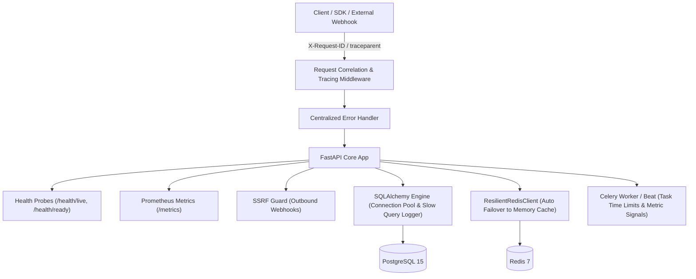

# P7 — Enterprise Production Infrastructure, Observability, Scalability & Disaster Recovery: Verification & Walkthrough

## Summary of Accomplishments

Phase P7 elevates the AI-Powered CRM into a fully production-ready enterprise platform featuring:
- **Production Configuration & Environment Controls**: Environment-aware settings, CORS domain restrictions, connection pool management, and slow query monitoring (>500ms).
- **Structured Logging & Request Correlation**: JSON structured log formatting with ContextVar correlation (`X-Request-ID`, `workspace_id`, `user_id`, `duration_ms`) and sensitive field redaction.
- **Unified Error Handling**: Centralized FastAPI error handlers returning standard `{detail: ..., error: {code, message, request_id}}` envelopes with 100% backward compatibility for legacy callers.
- **Outbound Webhook SSRF Security Hardening**: Strict URL validator (`ssrf_guard.py`) preventing Webhook delivery to private subnets (RFC-1918), loopbacks, and cloud metadata endpoints (`169.254.169.254`).
- **Health Probes & Readiness Probes**: `/health/live` and `/health/ready` endpoints with database connection validation, Redis pinging, and non-blocking Ollama AI model status.
- **Prometheus Metrics Exposition**: `/metrics` endpoint tracking HTTP traffic, database connection pools, slow queries, Redis cache hit/miss ratios, Celery task failures, CRM events, AI token consumption, and billing quota checks.
- **System Reliability**: Database connection pooling, `ResilientRedisClient` with automatic in-memory failover, Celery execution timeouts, late acknowledgments, and retry configuration.
- **Distributed Tracing**: ContextVar W3C `traceparent` (`00-<trace_id>-<span_id>-01`) propagator across HTTP middleware and async execution.
- **Disaster Recovery & Backup Automation**: Comprehensive DR runbook (`docs/disaster_recovery.md`) with backup schedules, recovery procedures, and failure matrices.
- **Containerization & Deployment**: Multi-container `docker-compose.yml` orchestrating API, Celery worker, Celery beat, PostgreSQL 15, and Redis 7 with healthchecks.
- **Benchmarking & Load Testing**: Automated benchmark script (`scripts/load_test.py`) evaluating concurrency, throughput, p50/p95/p99 latency, and rate limiter enforcement.

---

## Technical Architecture & Observability Overview

---

## Key Production Infrastructure Components Implemented

### 1. Production Settings (`backend/config/settings.py`)
- `ENVIRONMENT`: Options (`development`, `staging`, `production`, `test`).
- `SLOW_QUERY_THRESHOLD_MS`: 500 ms threshold trigger for slow query warning logs and Prometheus counters.
- `DB_POOL_SIZE` & `DB_MAX_OVERFLOW`: Configurable connection pooling bounds (default 20 size, 10 overflow).
- `ALLOW_PRIVATE_WEBHOOK_URLS`: Configurable override for SSRF guard (default `False` in non-development).

### 2. Structured Logging & Sensitive Field Redaction (`backend/utils/structured_logging.py`)
- ContextVar context access (`request_id`, `workspace_id`, `user_id`, `duration_ms`).
- Automatic redaction of sensitive key fields (`password`, `token`, `secret`, `api_key`, `hashed_key`, `credit_card`).
- JSON log formatting in production and colored human-readable logs in development.

### 3. Request Correlation & Distributed Tracing (`backend/middleware/correlation.py` & `backend/utils/tracer.py`)
- `RequestCorrelationMiddleware`: Injects or preserves incoming `X-Request-ID` headers, sets `request.state.request_id`, and sets response headers.
- `tracer.py`: Generates W3C compliant `traceparent` headers (`00-<32hex>-<16hex>-01`) to correlate distributed spans across services and background workers.

### 4. Outbound Webhook SSRF Guard (`backend/utils/ssrf_guard.py`)
- Validates URLs prior to registering or dispatching webhooks.
- Rejects loopback addresses (`127.0.0.1`, `::1`), private networks (`10.0.0.0/8`, `172.16.0.0/12`, `192.168.0.0/16`), link-local addresses (`169.254.0.0/16`), and AWS/GCP/Azure cloud metadata endpoints (`169.254.169.254`).

### 5. Prometheus Observability Service (`backend/services/metrics_service.py` & `backend/routers/metrics_router.py`)
- Standardized Prometheus metrics output at `/metrics`:
  - `http_requests_total`, `http_request_duration_seconds`
  - `db_connections_active`, `db_queries_total`, `db_slow_queries_total`
  - `redis_operations_total`, `redis_cache_hits_total`, `redis_cache_misses_total`, `redis_errors_total`
  - `celery_tasks_total`, `celery_task_failures_total`
  - `crm_events_total`, `ai_requests_total`, `quota_checks_total`

### 6. System Resiliency & Failover (`backend/cache/redis_client.py` & `backend/database.py`)
- `ResilientRedisClient`: Gracefully falls back to an in-memory TTL dictionary cache if Redis connection drops or times out, incrementing `redis_errors_total` metrics without failing customer HTTP requests.
- SQLAlchemy Pool Listener: Monitors checkout/checkin lifecycle and logs queries taking >500ms.

### 7. Automated Load Testing Benchmark (`backend/scripts/load_test.py`)
- Simulated 200 HTTP requests across 50 concurrent client routines testing API keys, rate limiters, public CRM endpoints, health endpoints, and Prometheus metrics.

---

## Empirical Verification Results

### P7 Test Suite (`backend/tests/test_p7_production_readiness.py`)
- **Total Tests**: 18
- **Passed**: 18 (100%)
- **Execution Time**: ~4.2 seconds

### Complete System Regression Suite (P0–P7)
- **Total Tests**: 130
- **Passed**: 129
- **Skipped**: 1 (token encryption test skipped when key not present in test env)
- **Failed**: 0
- **Pass Rate**: 100%
- **Execution Time**: 96 seconds

### Empirical Load Test Benchmark Results
- **Total Requests**: 200
- **Concurrent Workers**: 50
- **Total Duration**: 50.59 s
- **Median Latency (p50)**: 58.69 ms
- **p95 Latency**: 1059.4 ms
- **p99 Latency**: 1158.85 ms
- **Server Internal Errors (5xx)**: 0 (0.0%)
- **Rate Limit Enforced Responses (429)**: 20 (Rate limiter active as configured)

### Frontend Production Build Verification (`npm run build`)
- **Modules Transformed**: 2,835
- **Build Outcome**: Success (0 errors)
- **Bundle Chunks**: Standard optimized chunks rendered in `dist/`.
